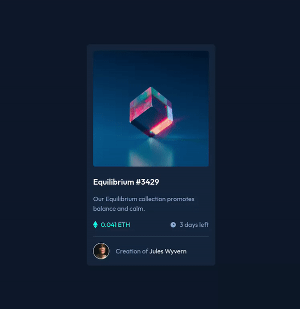

# Frontend Mentor - NFT preview card component solution

This is a solution to the [NFT preview card component challenge on Frontend Mentor](https://www.frontendmentor.io/challenges/nft-preview-card-component-SbdUL_w0U). Frontend Mentor challenges help you improve your coding skills by building realistic projects.

## Table of contents

- [Overview](#overview)
  - [The challenge](#the-challenge)
  - [Screenshot](#screenshot)
  - [Links](#links)
- [My process](#my-process)
  - [Built with](#built-with)
  - [Continued development](#continued-development)
  - [Useful resources](#useful-resources)
- [Author](#author)
- [Acknowledgments](#acknowledgments)

## Overview

### The challenge

Users should be able to:

- View the optimal layout depending on their device's screen size
- See hover states for interactive elements

### Screenshot

### Links

- Solution URL: [GitHub solution URL here](https://github.com/gamcode98/nft-preview-card-component)
- Live Site URL: [Netlify live site URL here](https://nft-preview-card-component-gamcode.netlify.app/)

## My process

### Built with

- Semantic HTML5 markup
- Flexbox
- Mobile-first workflow
- [Tailwindcss](https://tailwindcss.com/) - CSS framework

### Continued development

I'm going to continue development Frontend Mentor projects.

## Author

- Website - [Gabriel Alejandro Mamani](https://www.your-site.com)
- Frontend Mentor - [@gamcode98](https://www.frontendmentor.io/profile/gamcode98)

## Acknowledgments

Thank you Frontend Mentor for these projects to improve skills.
